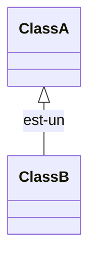

# Héritage
L’héritage est un des attributs fondamentaux de la programmation orientée objet. Il vous permet de définir une `classe
enfant` qui réutilise (hérite), étend ou modifie le comportement d’une `classe parente`. La classe dont les membres sont
hérités s’appelle la `classe de base`. La classe qui hérite des membres de la classe de base est appelée la `classe dérivée`.

[Application](https://chchabinlab.gitlab.io/labslides/heritage-application/#/)

## 1 - Création de sous classes – classes dérivées
- La notion d’héritage est un concept très important au niveau de la POO
- Il permet de définir (dériver) une nouvelle classe (B) à partir d’une classe existante (A)
- La classe existante (A) est appelée superclasse, classe parent ou bien classe de base
- La classe dérivée (B) est appelée sous classe ou classe enfant
- La sous classe hérite des propriétés de sa superclasse – données et méthodes
- La relation d’héritage est représentée ainsi (notation UML) :




- La relation `est-un` signifie que la sous classe est une forme (version) spécifique de la classe de base
- En plus d’hériter des propriétés de sa classe de base, la classe dérivée peut contenir de nouvelles méthodes, nouvelles variables ou bien modifier les propriétés héritées
- Le mécanisme d’héritage permet un meilleur partage, une meilleure réutilisabilité et permet également d’éviter la
- redondance - Gain en termes d’efforts relatifs à la conception, à l’implémentation et aux tests
- Pour établir une relation d’héritage entre deux classes, en C#, on utilise le mot clé `:` :

```csharp
public class B : A // la classe B dérive de la classe A
{ …… }
```


# ⚠️
Une classe héritée n’a pas accès aux champs et méthodes privés de la classe parente.



# 2 - Référence `base`
Le constructeur de la sous-classe appelle toujours celui de la classe de base, implicitement ou explicitement.

Si rien n'est spécifié, le compilateur génère un appel implicite au constructeur de la classe de base ne comportant aucun paramètre.

```csharp 
public class Vehicule 
{
    int roues, places, kilometrage;
    // Constructeur "protégé" : l'accès est limité
    // à cette classe et aux sous-classes
    public Vehicule(int roues,int places)
    {
        this.roues = roues;
        this.places = places;
    }
}
```
```csharp {hl_lines=[5]}
public class Automobile : Vehicule
{
    string couleur;
    public Automobile(string couleur)
    : base( 4, 5 ) // appel au constructeur de Vehicule
    // 4 roues et 5 places
    {
      this.couleur = couleur;
    }
	⋮
```
## 3 - Référence d'instance

Une référence à une instance de la sous-classe peut être stockée par une référence du même type :

```csharp
Automobile voiture = new Automobile();
```
Il est également possible d'utiliser une référence du type de la classe de base :

```csharp
Vehicule voiture = new Automobile();
```


## 4 - Méthodes Virtuelles et polymorphisme

### a - polymorphisme
Utiliser le `polymorphisme` consiste à écrire un code générique qui pourra s'appliquer à des objets appartenant à des 
classes différentes.

Le polymorphisme rend le code plus concis, plus élégant et plus sûr. C'est un mécanisme à utiliser dès que l'occasion se
présente. Il peut être enrichi grâce aux mécanismes que nous allons découvrir maintenant.

### b - méthode virtuelle
DÉFINITION : une méthode virtuelle (virtual) fournit un comportement par défaut dans une classe. Elle peut être redéfinie
(override) dans une classe dérivée.

Grâce aux méthodes virtuelles, on pousse encore plus loin les possibilités du polymorphisme.


```csharp  {hl_lines=[4]}
public class Vehicule
{
   ⋮
   public virtual string Description()
    {
        return $"Véhicule de {poids} tonnes";
    }
   ⋮
}
```

```csharp  {hl_lines=[5]}
public class Automobile : Vehicule
{
    ⋮
    // méthode redéfinie
    public override string Description()
    {
        return base.Description()+" de couleur "+couleur;
    }
	⋮
```