## Définition des tâches

La description des cas d’utilisation n’est pas suffisante pour définir les tâches qui devront être réalisées en
parallèles. Vous devez définir des tâches précises, par exemple:

- Maquettage de l’application (dessin *logique* des écrans attendus),
- Modification de la base de données si besoin
- Tests fonctionnels,
- Point 1 et 2 du cas d’utilisation 1
- ` `etc…
  
  La définition des tâches fait l’objet d’un document qui décrit rapidement chaque tâche, le cahier des tâches.
  Elaboration d’un diagramme de Gantt (ou autre) qui évalue les temps et définit les ressources (qui fait quoi). Vous
  utilisez un logiciel.

Ces tâches sont amenées à évoluer: certaines tâches n’ont pas été prévues au début du projet (par exemple); d’autres
tâches prendront plus de temps que prévu, certaines moins. C’est ainsi que vous aurez plusieurs versions de la
description des tâches (diag de Gantt) et de leurs affectations.

## Suivi du projet

Prévoir des **jalons, dates** où des objectifs devront être atteints: ceci donne lieu à un cahier « suivi de projet »
dans lequel est indiqué l’état d’avancement du projet.

*Par exemple, le premier jalon sera la définition d’une première version des tâches et de leurs répartitions, un autre
jalon serait la version 0.1 de l’application: l’architecture MVC sans accès au Modèle (que des vues et des contrôleurs).
Il faut fixer des dates pour ces jalons*.

## Faire un **fork** du projet sur gitlab
1. Inscrivez vous sur gitlab
2. Créez votre projet
3. Faire un fork du projet [gsbMvcMission1](https://gitlab.com/chchabinlab/gsbmvcmission1)
   {% figure-abs "images/exercices-et-challenges/missions/fork.png" "fork" "100%" "100%" %}


## Créer des tickets (Issues)

1. Allez sur le menu Issues
   {% figure-abs "images/exercices-et-challenges/missions/tickets.png" "tickets" "100%" "100%" %}
2. Créez un ticket
   {% figure-abs "images/exercices-et-challenges/missions/tickets-creer.png" "tickets-creer" "100%" "100%" %}
3. Expliquez où mettre une recette
   {% figure-abs "images/exercices-et-challenges/missions/tickets-ecrire.png" "tickets-ecrire" "100%" "100%" %}
4. Clore le ticket directement
   {% figure-abs "images/exercices-et-challenges/missions/tickets-fermer.png" "tickets-fermer" "100%" "100%" %}
5. Clore le ticket à partir du tableau récapitulatif
   {% figure-abs "images/exercices-et-challenges/missions/tickets-etat.png" "tickets-etat" "100%" "100%" %}


## Créer le wiki
### Créer un wiki public
1. créer la page HOME
2. créer des liens sur les autres pages sous la forme  
   `[nom du lien](nom-de-la-page)`
   
   Notez bien que les espaces sont remplacés par des `-` dans le nom de la page
   
### Créer un gantt avec mermaid
[mermaid](https://github.com/mermaid-js/mermaid) est une application qui crée des graphiques.
Pour obtenir ce graphique :
{% figure-abs "images/exercices-et-challenges/missions/gantt.png" "gantt" "100%" "100%" %}
Il faut utiliser ce code
```
## Gantt de l'application

```mermaid
gantt
title GANTT DE LA PREPARATION DE LA MISSION 1
dateFormat HH
axisFormat %H
    Début projet : milestone, 08,
    Mise en place :done,TA1, 08,   4h
    Creation de la vue : active,1h  
    Creation de la base   :done,after TA1, 1h
    Creation du modele   :  1h
    Creation de l'index   :         1h
    Creation de la vue accueil :  1h
    Creation du controleur   :        1h
    Creation de l'action : crit,1h
    Fin Projet : milestone,18
```


Il s'agit d'une combinaison de markdown et de mermaid


| code                            | description                                                               |
|---------------------------------|---------------------------------------------------------------------------|
| `##`                            | titre de niveau 2                                                         |  
| `title`                         | comme en html                                                             |  
| `dateFormat HH`                 | le format des dates est en heure (correspondant à la durée de la mission) |
| `Début projet : milestone, 08,` | milestone est un losange et le projet commence à 8 heures                 | 
|                                 | **Chaque ligne suivante correspond à une tâche et donc un ticket.**       |
| `4h`                            | durée de la tâche                                                         | 
| `TA1`                           | pointeur utilisé lorsque 2 tâches s'exécutent après une seule             |  
| `after TA1`                     | s'exécutent après la tâche identifiée par TA1                             | 
| `active`                        | tâche en cours                                                            |  
| `done`                          | tâche terminée                                                            |
| `critique`                      | tâche critique                                                            |


backticks : accent grave ou + 

Avant le code il faut écrire des backticks et mettre mermaid devant.  
A la fin du code il faut 3 backticks.
