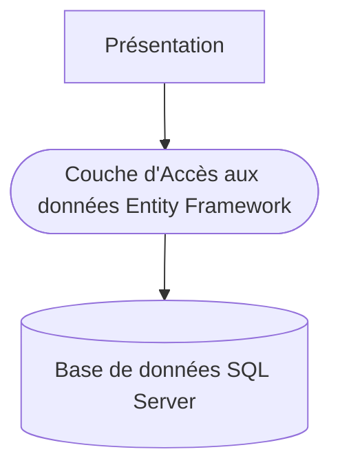

# Cahier des charges et description des données

## Présentation du projet
### L'activité à gérer
L'activité commerciale d'un laboratoire pharmaceutique est principalement réalisée par les visiteurs médicaux. En effet, 
un médicament remboursé par la sécurité sociale n’est jamais vendu directement au consommateur mais prescrit au patient 
par son médecin.

Toute communication publicitaire sur les médicaments remboursés est d'ailleurs interdite par la loi. Il est donc 
important, pour l’industrie pharmaceutique, de promouvoir ses produits directement auprès des praticiens. 

### Les Visiteurs Médicaux
L'activité des visiteurs médicaux consiste à visiter régulièrement les médecins généralistes, spécialistes, les services 
hospitaliers ainsi que les infirmiers et pharmaciens pour les tenir au courant de l’intérêt de leurs produits et des 
nouveautés du laboratoire.

Chaque visiteur dispose d’un portefeuille de praticiens, de sorte que le même médecin ne reçoit jamais deux visites 
différentes du même laboratoire.

Comme tous les commerciaux, ils travaillent par objectifs définis par la hiérarchie et reçoivent en conséquence diverses 
primes et avantages.

Pour affiner la définition des objectifs et l’attribution des budgets, il sera nécessaire d’informatiser les comptes 
rendus de visite.

### L’activité des visiteurs
L'activité  est composée principalement de **visites** : réalisées auprès d’un praticien (médecin dans son cabinet,
à l’hôpital, pharmacien, chef de clinique…), on souhaite en connaître la date, le motif (6 motifs sont fixés au préalable),
et savoir, pour chaque visite, les médicaments présentés et le nombre d’échantillons offerts. Le bilan fourni par le 
visiteur (le médecin a paru convaincu ou pas, une autre visite a été planifiée…) devra aussi être enregistré.

### Les produits
Les produits distribués par le laboratoire sont des médicaments : ils sont identifiés par un numéro de produit 
(dépôt légal) qui correspond à un nom commercial (ce nom étant utilisé par les visiteurs et les médecins).

Comme tout médicament, un produit a des effets thérapeutiques et des contre-indications.

On connait sa composition (liste des composants et quantité) et les interactions qu'il peut avoir avec d'autres 
médicaments (éléments nécessaires à la présentation aux médecins).

La posologie (quantité périodique par type d’individu : adulte, jeune adulte, enfant, jeune enfant ou nourrisson) 
dépend de la présentation et du dosage.

Un produit relève d’une famille (antihistaminique, antidépresseur, antibiotique, …).

Lors d'une visite auprès d'un médecin, un visiteur présente un ou plusieurs produits pour lesquels il pourra laisser 
des échantillons. 

### Les médecins
Les médecins sont le cœur de cible des laboratoires. Aussi font-ils l’objet d’une attention toute particulière.

Pour tenir à jour leurs informations, les laboratoires achètent des fichiers à des organismes spécialisés qui donnent, 
les diverses informations d’état civil et la spécialité complémentaire.

La modélisation complète des données est présentée ci-dessous
{% figure-abs "images/exercices-et-challenges/missions/mission3SGBD.png" "mission3SGBD"  "100%" "100%" %}

## L’application à réaliser
Actuellement l’application est juste ébauchée. Elle est installée au siège de GSB et est développée en C# avec une couche
de persistance (EF) qui atteint la base de données SQL Server *gsbrapport2021*.

L’application devra gérer les visiteurs, les médecins, les médicaments et permettre de créer des rapports, à partir de 
fiches de rapport de visite envoyées par les visiteurs par mail au format pdf.

L’application devra produire également différents états.

Les cas d’utilisation envisagés sont les suivants :
{% figure-abs "images/exercices-et-challenges/missions/mission3UseCase.png" "mission3UseCase" "100%" "100%" %}

L’ébauche de l’application met en oeuvre 3 couches :

## Les contraintes
- La base de données est sous SQL Server,
- Le dossier de développement doit contenir les tests fonctionnels clairement définis et validés. Ces tests doivent être définis avant tout codage.
- La gestion des erreurs doit être soignée
- Le code doit être conforme aux règles de développement définies pour le la mission 2
- Les règles de nommage concernant notamment les composants graphiques doit faire l’objet d’un document unique pour toutes les missions. Ce document est à écrire avant le codage.
- L’application doit  proposer un graphisme homogène faisant apparaître le logo de la société GSB
- La phase d’intégration doit permettre de regrouper les différents modules
- De nouveaux besoins fonctionnels pourront apparaitre en cours de mission.

