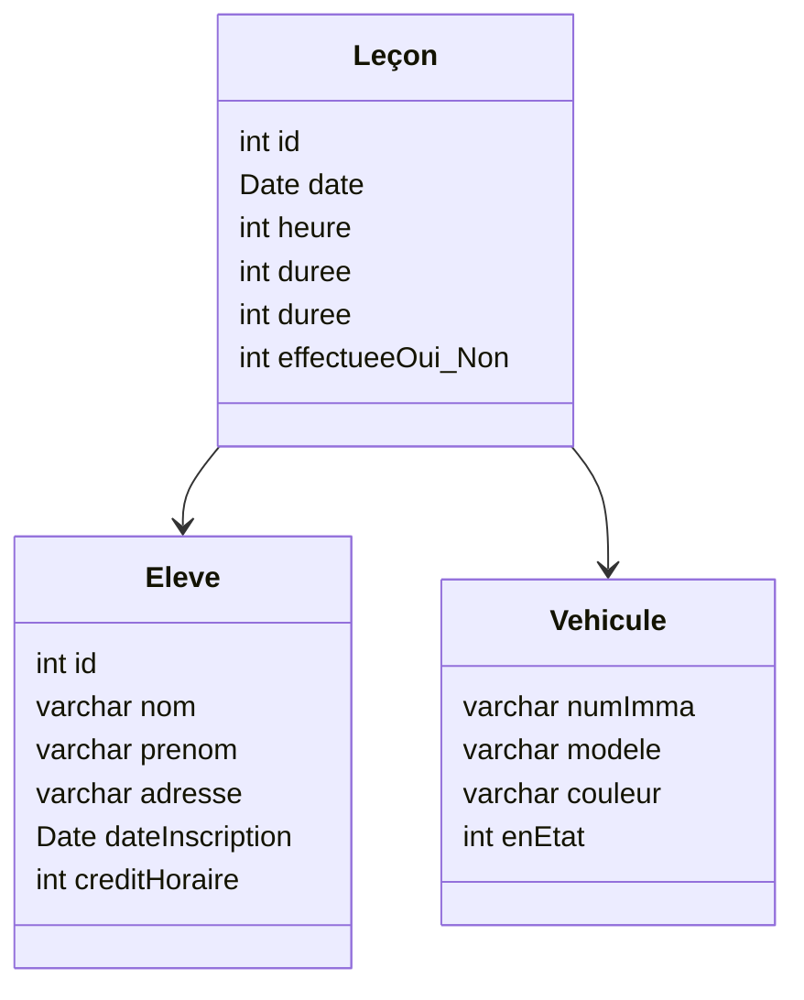
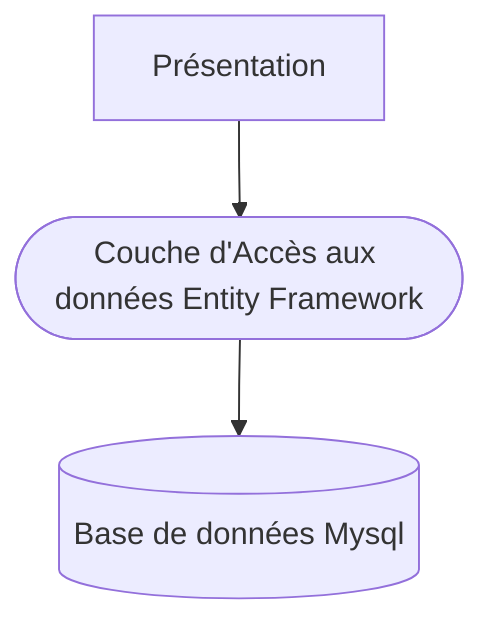


### BLOC 2
2.1.2 Modéliser une solution applicative  
2.1.3 Utiliser des composants d’accès aux données  
2.1.5 Réaliser des tests nécessaires à la validation ou à la mise en production


## A - Fonctionnalités attendues
{% figure-abs "images/exercices-et-challenges/cas/autoecoleUseCase.png" "autoecoleUseCase" "100%" "100%" %}
## B - La base de données
La base de données est sous MySql.
Le schéma relationnel est le suivant :

Dans la table eleve, le crédit horaire correspond au nombre d’heures restant à effectuer.

Dans la table Leçon, le champ heure correspond à l’heure de la leçon dans la journée, la durée est la
durée de la leçon (une ou deux heures) ; le champ effectueeOui_Non indique si la leçon a
effectivement eu lieu.

## C - Architecture
L’application présente 3 couches :

- La base de données
- Une couche de mapping utilisant le Framework Entity Framework (version 4.0) qui va
permettre d’utiliser un modèle objet directement relié aux tables.
- La couche de présentation : une application WinForm
## D - Mise en place du server
#### a) Configuration de la base de données
1. Récupérez le fichier `w10SqlExpress.ova` et lancez le
2. Lancez le fichier SSMS
   {% figure-abs "images/exercices-et-challenges/ssms.png" "ssms" "100%" "100%" %}
3. Récupérez le fichier sql [autoecole]()
4. Créez la base de données en double cliquant sur `Databases`
   {% figure-abs "images/exercices-et-challenges/sqlserverexecut00.png" "sqlserverexecut00"  "100%" "100%" %}
5. Chargez le fichier sql avec `File>Open>File` ou `CTRL + O` et Exécutez le
   {% figure-abs "images/exercices-et-challenges/sqlserverexecut01.png" "sqlserverexecut01" "100%" "100%" %}
#### b) configuration de l'accès distant
1. Lancer `cmd` dans la recherche
2. Saisir `ipconfig /all` et notez l'`adresse IP`
3. Lancer le `Gestionnaire de Configuration SQL Server 2022`
## E - Développement de l’application
Cette première version ne mettra pas en œuvre de couches logicielles, ainsi tout le code sera dans le
même projet ; pour cette partie, nous nous attachons à découvrir les fonctionnalités de l’accès aux
données avec le Framework `Entity`.
### a) Création du projet.

1. Créer un projet de type `WinForm`, choisissez la version `.NET framework`, nommez-le `autoEcoleEF`.  
2. Ajouter au projet un nouvel élément ADO

{% figure-abs "images/exercices-et-challenges/cas/autoecoleADO.png" "autoecoleADO" "100%" "100%" %}
Cet élément utilise une bibliothèque de classe (un Framework Entity Framework –EF-) dédiée à
l’accès aux données.  
Un assistant va générer ensuite des classes permettant cet accès aux données.
{% figure-abs "images/exercices-et-challenges/cas/autoecoleConnexion.png" "autoecoleConnexion" "100%" "100%" %}


**Configurer la connexion** :  
1. Sélectionner la base de données autoEcole dans la liste.    
2. Tester.  
3. Faire suivant et accepter le nom de la connexion proposée.

{% figure-abs "images/exercices-et-challenges/cas/autoecoleLocalhost.png" "autoecoleLocalhost" "100%" "100%" %}

L’assistant va ensuite vous demander de sélectionner les tables visées :  
1. **Cocher bien les deux cases**.  
2. Modifier le nom du namespace proposé.  
3. Faire terminer.  

{% figure-abs "images/exercices-et-challenges/cas/autoecoleTables.png" "autoecoleTables" "100%" "100%" %}
Entity Framework génère un modèle objet qui sera chargé en mémoire :
{% figure-abs "images/exercices-et-challenges/cas/autoecoleModele.png" "autoecoleModele" "100%" "100%" %}
Chaque table devient ainsi une classe. Les propriétés de navigation permettront de naviguer de
classe en classe, si on le souhaite. Notez le singulier ou le pluriel sur ces propriétés. Ainsi une leçon
concerne un seul véhicule et un seul élève ; par contre l’élève a plusieurs leçons, et le véhicule aussi.

Remarquons également que la classe lecon contient des champs correspondant aux clés étrangères :
`idEleve` et `numImmaVehicule` ; nous pouvions ne pas générer cette présence des clés étrangère en
décochant plus haut la case Inclure les colonnes clés étrangères…  

Nous allons modifier ce modèle en supprimant la propriété de navigation lecons dans la classe
vehicule ; en effet, nous ne demanderons jamais à un véhicule de nous donner les leçons associées.
Faire un clic droit/supprimer sur ce champ de navigation.  

Regardons le fichier XML `App.Config`. **C’est dans ce fichier que se trouvent les paramètres de
connexion**.

### b) Le formulaire menu

1. Modifier son nom, `FrmMenu`, 
2. Ajouter un menu (Boite à outils/MenuStrip) 
3. Dans les propriétés du formulaire mettre `IsMdiContainer` à `True`

   {% figure-abs "images/exercices-et-challenges/cas/autoecoleMenu.png" "autoecoleMenu" "100%" "100%" %}
   
4. Ajoutez des sous-menus
-   Fichier/Quitter
-   Elève/Gérer
-   Véhicule/Gérer et Véhicule/Liste
-   Leçon/Ajouter et Leçon/Valider
   
C’est dans ce formulaire que nous allons créer un objet d’accès aux données.




5. Déclarer un champ privé de type `autoecoleEntities` qui est notre classe de contexte

   Cette source de données est ajoutée au projet, elle restera disponible pour d’autres formulaires.
   {% figure-abs "images/exercices-et-challenges/cas/autoecoleEdmx.png" "autoecoleEdmx" "100%" "100%" %}
   C’est cette classe
   qui assure la liaison à la base, gère le mapping avec le modèle relationnel, sauvegarde les données en
   base.
   {% figure-abs "images/exercices-et-challenges/cas/autoecoleContexte.png" "autoecoleContexte" "100%" "100%" %}
Chaque formulaire associé à une option du menu sera construit avec ce contexte comme argument.  
Pour que les formulaires s'intègrent dans le MDI, il faut copier le code de cette façon :
   {% figure-abs "images/exercices-et-challenges/cas/autoecoleMDI.png" "autoecoleMDI" "100%" "100%" %}

### c) Le formulaire Elève/Gérer

- Ajouter au projet un nouveau formulaire, `FrmGererEleve`.

Il doit ressembler à ceci :
{% figure-abs "images/exercices-et-challenges/cas/autoecoleGerer.png" "autoecoleGerer" "100%" "100%" %}
Le champ de type date est un DateTimePicker, le crédit horaire un ComboBox, ne tenez pas compte
de la barre de navigation pour l’instant.

- Réaliser en conception ce formulaire, attention au nommage des composants :  
txtNum, txtNom, …, dtInscription, cmbCredit
- Le comboBox proposant le crédit horaire doit être chargé par une boucle :

  {% figure-abs "images/exercices-et-challenges/cas/autoecoleCombobox.png" "autoecoleCombobox" "100%" "100%" %}
  
- Nous allons ensuite lier l’ouverture de ce formulaire au formulaire de menu :
  
  {% figure-abs "images/exercices-et-challenges/cas/autoecoleLienEleve.png" "autoecoleLienEleve" "100%" "100%" %}
  
- Dans le formulaire FrmMenu :
  
  

#### Notion de binding
Le binding est un mécanisme qui permet de lier un composant graphique de présentation à une
source de données. Cette liaison est bi-directionnelle, si l’on modifie la source, l’information sera
transmise au composant et si on modifie l’information présente dans le composant, ceci sera
répercuté dans la source de données. Une source de donnée peut être de nature très variée, ce peut
être une table d’une base, une classe en mémoire, une liste typée. Dans notre cas, il s’agit d’une
classe en mémoire.

On peut représenter les différentes responsabilités ainsi :


Le binding est mis en œuvre grâce à un composant qu’il faut installer dans le formulaire.  

Il se trouve dans la partie Données de la boite à outils :


Déposez-le sur le formulaire ; il n’apparait pas dessus, mais en dessous.

Ce composant n’est pas un composant graphique.


- Il faut maintenant le renommer (`bdgSourceEleve`) et lui indiquer sa source de
données qui est la classe `eleve` (et pas, bien sûr la table eleve).
- Dans les propriétés du composant, cliquer sur DataSource, ajouter une nouvelle source de données.
- Indiquer que la source est un objet.
  
  
  
Sélectionner la classe eleve.
  
  
  
- Si la source n'apparait pas, compilez le projet.
 
  Le composant de binding connait maintenant sa source de données :
  
  
  Remarque : la liaison se fait sur la classe (en fait Entity selon les termes de MS),  
**il n’y a pas encore de chargement des données venant de la classe de contexte de donnée**.
  
  Ce chargement des données se fera par le code :
  
  Nous venons donc de lier le composant de binding à la source de données ; il faut maintenant lier le
  composant graphique et le composant de binding.

  C’est ce que nous ferons par la propriété `DataBinding/text` du premier textBox (celui qui contient l’id de
  l’élève) que nous lierons à l’id de `bdgSourceEleve` pour son champ `id` :
  
  
  Faites de même pour toutes les propriétés Text des composants du formulaire.
  

Si nous lançons l’application, on constate l’accès aux données


**Naviguer dans la table**

Nous allons utiliser un composant dédié à la navigation, le `BindingNavigator`.


Déposer le sur le formulaire.


Le formulaire fait apparaître une barre de navigation.


- Modifiez son nom en `bdgNav`
- Paramétrons ce composant dans sa propriété `BindingSource`



Si nous testons l’application, nous remarquons la possibilité de modifier, supprimer un élève.  

Mais si nous relançons l’application, la base de données n’a pas été modifiée ; pour cela, il faut
demander explicitement à la classe qui communique avec la base de la faire, la classe
`autoEcoleEntities`. On le fera un peu plus tard.  

#### Intéressons-nous au bouton d’ajout du navigateur. 
Se pose le problème de l’identifiant, il n’est pas
auto-incrémenté dans la base, il doit prendre une valeur ici (d’autres solutions pouvaient être
envisagées –procédure stockée-). Nous allons générer un numéro qui incrémente le numéro
maximum existant.  

- Écrire la méthode `getNumEleve` dans la classe `FrmGererEleve`.
  
  

On voit ici ce qu’on appelle une requête `linq`, langage d’interrogation des données pour les classes de
mapping. L’avantage est de bénéficier de l’IntelliSense lorsqu’on requête, le prix à payer c’est le
nouveau langage de requêtage !!

Mettre le champ `txtNum` à `readOnly = true` (l’utilisateur ne peut ainsi pas modifier l’identifiant) on va faire un appel 
à cette méthode lorsque l’on désire ajouter un nouvel élève.

Ouvrez le code l’événement clic du bouton ajouter du navigateur :


#### Intéressons-nous au bouton enregistrer

Ajoutez un bouton à la barre de navigation, dans sa page de propriété indiquons
`Enregistrer` à sa propriété Text, il est judicieux d'ajouter une image de disquette, par exemple,  et dans le code de 
l’événement clic associé :

Pour enregistrer l'insertion dans la basse de donnée il faut passer par l'insertion d'un objet.

L’instruction `endEdit()` permet de valider dans le modèle de classe la création. Cet appel doit se faire
explicitement parfois lorsque nous voulons faire prendre en compte immédiatement une
modification. Cet appel est le plus souvent fait automatiquement.

L'appel à `Add` permet d'ajouter l'objet dans la classe `eleve`.

L’appel à `SaveChanges()` se justifie ici, car la méthode `getNumEleve` est une requête linq qui va
chercher en base un nouveau numéro ; si nous n’enregistrons pas en base ce numéro, la requête
retournera toujours la même valeur ;

#### Intéressons-nous au bouton supprimer

Modifiez la propriété `DeleteItem` à `aucun`, sinon la suppression se fera dans le `BindingSource` mais pas dans la base de donnée.


En suite il faut relier la modification à la base de données :

L'appel `bdgSourceEleve.RemoveCurrent()` permet de supprimer l'élève à l'affichage.
Pour pouvoir supprimer l'élève dans la base de donnée il faut passer par un contexte temporaire `context`. Ensuite il faut
rechercher avec une requête `linq` la données dans la base, stockée dans la variable `entiteASupprimer`.
L'appel à `Remove` permet de supprimer l'objet dans la classe `eleve`.

L'appel à `SaveChanges()` se justifie ici, comme précédemment.

### d) Le formulaire Véhicule/Gérer

En vous inspirant du formulaire précédent, créer ce formulaire `FrmGererVehicule` et le code associé.
Contrainte : les champs doivent être en `readOnly`, sauf si on ajoute un véhicule.

Voici la maquette attendue :


#### Un petit bug

Lorsque l’on ajoute un nouveau véhicule (il en était de même pour l’ajout d’un nouvel élève) et que
l’on ne saisit pas les informations, l’application actuellement ne signale pas d’erreur. Nous allons
modifier ce comportement. L’idée, c’est que, si l’utilisateur « sort » de l’ajout (en cliquant sur l’un des
3 boutons disponibles, `movePrevious`, `moveFirst`, `addNew`) sans avoir rempli les champs nécessaires,
l’application le signale et annule la demande en cours.
1. Il faut dans un premier temps positionner la propriété `CheckOnClicK` à `true` pour les trois
boutons énumérés plus haut, ce qui n’est pas fait par défaut. Ainsi, par défaut, si on clic
sur un bouton, il n’est pas checké ! On peut regretter ce comportement par défaut.
2. Il faut « intercepter » l’événement lorsque le bouton est « dé-chécké », événement qui a lieu
avant l’événement click. C’est l’événement `checkedChanged`.
   
Il faut procéder de même pour les deux autres boutons concernés, `moveFirst`, `addNew`.
   La méthode `CancelEdit` annule la dernière modification.

L'idéal est de créer une méthode `validationVehicule`.


### e) Le formulaire Véhicule/Liste
Le formulaire, `FrmListeVehicule`, permet de visualiser tous les véhicules et éventuellement modifier le champ en Etat.
Voici la maquette attendue :


1. Créez un nouveau formulaire `FrmListeVehicule`, 
2. liez-le à l’ouverture de l’option Véhicule/Liste du menu principal, 
3. modifiez son constructeur, 
4. passez le champ privé dans l’appel de la construction,
5. ajouter un composant de binding : `bdgVehicules`, 
6. créez une nouvelle source de données pour valoriser son champ DataSource.

   
   
7. Déposez dans le formulaire un DataGridView, 
8. renommez-le `dgvVehicule`, 
9. valorisons sa propriété DataSource :
   
   
   
10. Sur un clic droit, sur le DataGridView, modifiez les colonnes pour rendre les 3 premières en
   readOnly :



11. Ajoutez le chargement des données dans la construction :

    
    
12. Enfin, ajoutez un bouton dans le formulaire pour enregistrer les modifications :
    


### f) Le formulaire d’ajout d’une leçon
Voici la maquette attendue :

En effet, le véhicule sera ajouté plus tard ainsi que l’enregistrement du champ `effectuee_oui_non`.

1. Créez ce formulaire, `FrmAjoutLecon`, et liez-le au menu, comme déjà fait plus haut,
2. liez le comBox des élèves à la source de données des élèves,
3. déposez un composant de binding `bdgEleve` lié à la source de données déjà créée


   
4. Liez le comboBox `cmbEleve` à cette source :
   
   
   
5. Remplissez la source de données et chargeons `cmbHeure` avec des données correspondant à des horaires
   
   
   Pour enregistrer une nouvelle leçon, il nous faut faire comme pour un nouvel élève, générer un id
   incrémenté.
   
6. Mettez en œuvre une requête plus performante :

   
   
7. Générez un objet de type `lecon`
   
   
   
   Remarques : nous récupérons l’élève concerné par la leçon par la propriété `SelectedValue`.

   Le constructeur généré pour la classe `lecon` est le constructeur par défaut (sans argument) ; c’est
   pourquoi nous employons des `seter` pour valoriser les champs. Nous aurions pu aussi surcharger ce
   constructeur.
   
8. Enregistrez la nouvelle leçon par l’appel du clic sur le bouton enregistrer
   
   

### g) Le formulaire Leçon/Valider
Il s’agit ici de fixer le numéro d’immatriculation du véhicule et indiquer que la leçon a eu lieu ou pas.
Voici la maquette attendue :

Procédez comme pour les autres formulaires :

1. Ajoutez un formulaire `FrmValiderLecon`,  
2. liaison au menu,  
3. déclaration du champ de contexte de données,   
4. modification du constructeur.
5. Ajoutez un composant de binding `bdgSlecon` 
6. liez ce composant à la classe `lecon`,
7. Ajoutez un DataGridView 
8. liez-le par sa propriété DataSource au composant de binding `bdgSlecon`


**Modification des colonnes du DataGridView**

1. ajoutons un second composant de binding `bdgSvehicule`, 
2. liez-le à la source vehicule (déjà créée),
3. sur un clic droit sur le DataGridView, supprimez des colonnes,
4. transformez `effectueeOui_Non` en CheckBox, dans Données spécifiez la valeur `False` et `True`
5. transformez `numImmaVehicule` en ComboBox, que nous lions à la source `bdgSvehicule`.
6. Le bouton enregistrer met à jour la base
7. chargez les données



## F - Pour aller plus loin
### a) Le formulaire Leçon/Valider : version 2 (pour aller un peu plus loin)
Il est dommage que nous identifiions l’élève par son id, qui n’est pas très parlant, et par ses nom et
prénom. Par ailleurs, nous allons un peu modifier le formulaire pour ne proposer dans le
DataGridView que les leçons non encore validées.


Nous sommes confrontée à une difficulté liée à la conception des DataGridView, ceux-ci ne
savent/peuvent pas se lier/binder (dans les deux sens lecture/écriture) à une « jointure », ce qui
serait le cas dans l’hypothèse de faire apparaître le nom de l’élève dans le DataGridView. Une
solution serait de modifier le comportement initial d’un DataGridView en le spécialisant. Solution
que nous écartons.


Nous aurions pu aussi intervenir au niveau du modèle de classe et « migrer » des propriétés de la
classe `eleve` vers la classe `lecon`, le nom et le prénom de l’élève aurait été ainsi directement
accessibles.


Nous procèderons autrement en faisant apparaître dans un autre composant les noms et prénoms
des élèves.


Concernant la seconde modification (ne faire apparaître que certaines leçons, celles qui ne sont pas
validées), il existe une propriété filter dans une source de données qui aurait pu faire l’affaire
(`effectuee_OuiNon = false`) mais la documentation MSDN est très incomplète sur cette question.


Donc, nous voulons obtenir un formulaire qui ressemble à ceci :

Seules les leçons non validées sont visibles, ainsi que le nom et prénom de l’élève.

Créez une nouvelle source de données, à partir d’une requête linq.



Remarque : le type de var est IQueryable, ce type peut être bindé (dans les deux sens) ou pas !! ça
dépend de la requête : si la requête ne fait que filtrer les lignes (select * from uneTable where, en
SQL), la source de données est bindable dans les deux sens ; si par contre, nous réduisons les
colonnes ou faisons une jointure, la source est bindable dans un seul sens (pas de mode edit du
composant).



Créez les colonnes du DataGridView par le code, ce qui donne au final :


Pour le bouton, nous avons :


### b) Un formulaire visualisant les leçons d’un élève : deux DataGridView liés
Nous voulons obtenir les leçons des élèves à partir d’un DataGridView d’élèves :


Déposez 3 sources de données :


Ces sources sont configurées (propriété dataSource) pour qu’elles pointent vers les classes `eleve`, `lecon` et `vehicule`.

Déposez un DataGridView lié à la source bdgSeleve (propriété dataSource)  
Supprimez les colonnes inutiles :



Déposez un second DataGridView lié à la source bdgSlecon,  
modifiez ses colonnes   
remplaçez la colonne texte par un ComboBoxColumn pour le numéro d’immatriculation (cf plus haut) :



Renseignez la propriété de binding du DataGridView ainsi :

On va chercher la propriété avancée du DataBinding :


Dans la fenêtre proposée indiquez la DataSource ; ici ce sont les leçons de chaque élève :


Ce qui va produire :


Chargez les sources de données :



La ligne :
```csharp
this.bdgSeleve.DataSource = this.mesDonneesEF.eleves.Include("lecons");
```
utilise une méthode `Include` qui permet de charger pour chaque élève ses leçons. Ce qui n’est pas fait
par défaut. EF met en œuvre ce que l’on appelle le `lazy loading` (chargement paresseux) ; par
exemple si on charge en mémoire un objet, **ses** objets associés ne sont pas disponibles ; il faut
utiliser explicitement un `Include(<nom de la propriété de liaisons>)` pour obtenir ses objets liés.


### c) Les procédures stockées

#### a) Côté MySql
Nous allons tout d’abord créer une procédure stockée dans MySql ; cette procédure créera un
nouveau véhicule dont on passera les valeurs de tous les champs :

Créez la procédure stockée dans MySql



Notez le délimiteur `|` après le `END`


Lancer son exécution dans MySql en changeant le délimiteur par défaut (`;`) en `|` :



#### b) Côté EF

Ouvrez le modèle edmx,  
Cliquez n’importe où,  
Demandez à mettre à jour le modèle à partir de la base de données :



Regénérez l’application,  
Vérifiez que vous avez bien la procédure stockée en relançant l’assistant de mise à jour du modèle :


Dans l’explorateur de modèle :

Vous allez importer une nouvelle fonction :

Voila, c’est tout ; vous pouvez vérifier en appelant la fonction newVehicule qui devient une méthode
du modèle :
```csharp
this.mesDonnesEF.newVehicule("123ZA79", "renault", "bleue", 1);
```
